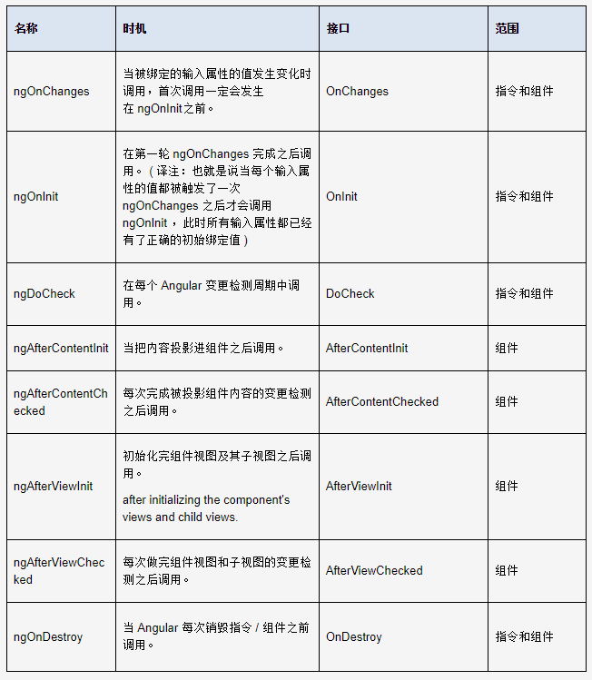

```javascript

interface NgModule {
     // providers: 这个选项是一个数组,需要我们列出我们这个模块的一些需要共用的服务
     //            然后我们就可以在这个模块的各个组件中通过依赖注入使用了.
    providers : Provider[]
     // declarations: 数组类型的选项, 用来声明属于这个模块的指令,管道等等.
     //               然后我们就可以在这个模块中使用它们了.
    declarations : Array<Type<any>|any[]>
     // imports: 数组类型的选项,我们的模块需要依赖的一些其他的模块,这样做的目的使我们这个模块
     //          可以直接使用别的模块提供的一些指令,组件等等.
    imports : Array<Type<any>|ModuleWithProviders|any[]>
     // exports: 数组类型的选项,我们这个模块需要导出的一些组件,指令,模块等;
     //          如果别的模块导入了我们这个模块,
     //          那么别的模块就可以直接使用我们在这里导出的组件,指令模块等.
    exports : Array<Type<any>|any[]>
    // entryComponents: 数组类型的选项,指定一系列的组件,这些组件将会在这个模块定义的时候进行编译
    //                  Angular会为每一个组件创建一个ComponentFactory然后把它存储在ComponentFactoryResolver
    entryComponents : Array<Type<any>|any[]>
    // bootstrap: 数组类型选项, 指定了这个模块启动的时候应该启动的组件.当然这些组件会被自动的加入到entryComponents中去
    bootstrap : Array<Type<any>|any[]>
    // schemas: 不属于Angular的组件或者指令的元素或者属性都需要在这里进行声明.
    schemas : Array<SchemaMetadata|any[]>
    // id: 字符串类型的选项,模块的隐藏ID,它可以是一个名字或者一个路径;用来在getModuleFactory区别模块,如果这个属性是undefined
    //     那么这个模块将不会被注册.
    id : string
 }


```



```javascript

组件生命周期钩子

指令和组件的实例有一个生命周期：新建、更新和销毁。
每个接口都有唯一的一个钩子方法，它们的名字是由接口名加上 ng前缀构成的。比如，OnInit接口的钩子方法叫做ngOnInit。
指令和组件
ngOnInit：当Angular初始化完成数据绑定的输入属性后，用来初始化指令或者组件。
ngOnChanges：当Angular设置了一个被绑定的输入属性后触发。该回调方法会收到一个包含当前值和原值的changes对象。
ngDoCheck：用来检测所有变化（无论是Angular本身能检测还是无法检测的），并作出相应行动。在每次执行“变更检测”时被调用。
ngOnDestory：在Angular销毁指令或组件之前做一些清理工作，比如退订可观察对象和移除事件处理器，以免导致内存泄漏。
只适用于组件
ngAfterContentInit：当Angular把外来内容投影进自己的视图之后调用。
ngAfterContentChecked：当Angular检查完那些投影到自己视图中的外来内容的数据绑定之后调用。
ngAfterViewInit：在Angular创建完组件的视图后调用。
ngAfterViewChecked：在Angular检查完组件视图中的绑定后调用。

生命周期的顺序

ngOnChanges：当被绑定的输入属性的值发生变化时调用，首次调用一定会发生在ngOnInit之前。
ngOnInit：在第一轮ngOnChanges完成之后调用。
ngDoCheck：在每个Angular变更检测周期中调用。
ngAfterContentInit：当把内容投影进组件之后调用。
ngAfterContentChecked：每次完成被投影组件内容的变更检测之后调用。
ngAfterViewInit：初始化完组件及其子视图之后调用。
ngAfterViewChecked：每次做完组件视图和子视图的变更检测之后调用。
ngOnDestroy：当Angular每次销毁指令/组件之前调用。


```